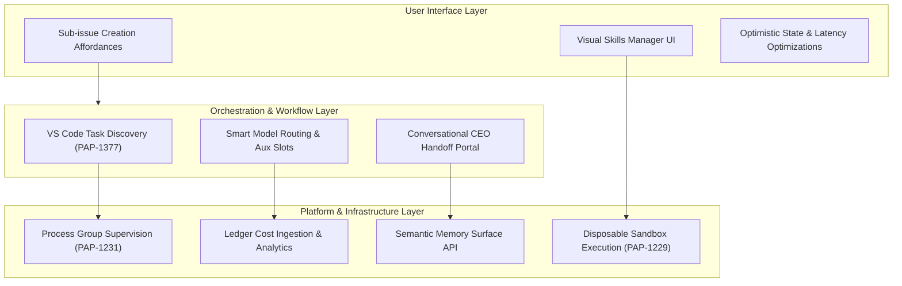

# Paperclip Master Pending Work Plan (Single Source of Truth)

**Status:** Active Master Reference  
**Date:** 2026-05-23  
**Audience:** Product, engineering, contributors, and AI orchestrators  
**Primary Input Sources:** `doc/ROADMAP.md`, `doc/plans/` historical archives  

This document serves as the absolute single source of truth for all pending product, backend, frontend, and infrastructure work in Paperclip. By centralizing these designs, we eliminate competing checklists and prevent duplicate or stale tracking.

---

## 🗺️ Visual Architectural Flow of Pending Work

---

## 🏛️ 1. Platform & Process Supervision

### 🧹 1.1 Heartbeat Process-Group Supervision (`PAP-1231`)
*   **Problem:** Heartbeat-run local adapters track only a single `process_pid`. If Codex or Claude launches Chrome, Chromium, or other helper processes, they are orphaned when the direct child process finishes or is cancelled, leading to massive memory/process leaks.
*   **Actionable Tasks:**
    - [x] **Database Schema:** Add a nullable `process_group_id` integer column to `heartbeat_runs`.
    - [x] **Process Spawning:** Update `runChildProcess()` in `packages/adapter-utils/src/server-utils.ts` to spawn child processes with `detached: true` on POSIX platforms.
    - [x] **Termination Logic:** Replace `child.kill()` with process-group-aware termination (`process.kill(-processGroupId, signal)`) escalating from `SIGTERM` to `SIGKILL` after a grace period.
    - [x] **Orphan Recovery:** Update active run recovery to assert status on the whole process group rather than a single PID.

### 📊 1.2 Unified Billing Ledger & Provider Reporting
*   **Problem:** Spend reporting is scattered and tries to infer billing logic from `heartbeat_runs.usage_json` and `cost_events` concurrently, making multi-provider aggregator reporting inaccurate.
*   **Actionable Tasks:**
    - [ ] **Ledger Schema:** Extend `cost_events` to carry unified billing dimensions: `upstream_provider`, `biller` (e.g. OpenRouter vs Direct), `billing_type` (metered, subscription, credit), and `billed_amount_cents`.
    - [ ] **Aggregation logic:** Re-implement all cost/spend reporting queries in the server to aggregate exclusively from `cost_events`.
    - [ ] **Operational Decoupling:** Decouple `heartbeat_runs` from billing analytics completely; runs should only mirror usage metadata for developer transcripts and run details.

### 🔒 1.3 Capability Permissions & Disposable Execution Roots (`PAP-1229`)
*   **Problem:** Local adapters currently execute in a fully trusted environment. We need a low-risk sandboxed execution model for untrusted agent tasks.
*   **Actionable Tasks:**
    - [ ] **Permissions Vocab:** Define a capability-based permission schema for adapters (e.g., `fs:read`, `fs:write`, `net:outbound`).
    - [ ] **Disposable Roots:** Design a snapshot-backed disposable workspace runner that clones a git checkout, mounts it as a temporary workspace, and discards it after execution.

---

## ⚙️ 2. Orchestration & Workflow Automation

### 🔌 2.1 VS Code Task Interoperability (`PAP-1377`)
*   **Problem:** Developers currently must hand-author JSON runtime settings. We need a way to automatically import and run tasks defined in a repository's `.vscode/tasks.json`.
*   **Actionable Tasks:**
    - [x] **Task Parser:** Build a schema-validated discovery parser to read shell/process tasks from `.vscode/tasks.json`.
    - [x] **Semantic Mapping:** Map discovered tasks to supervised **Workspace Services** (long-running) or **Workspace Jobs** (one-shot).
    - [x] **Task Controls:** Expose a discovered commands list in the UI to allow operators to run jobs or start services instantly.

### 🧠 2.2 Smart Model Routing & Auxiliary Model Slots
*   **Problem:** Heartbeats assume one model per run. We need to split work between cheap models (for initial triage/waking) and primary models (for coding) to save token cost.
*   **Actionable Tasks:**
    - [ ] **Model Slots:** Extend agent configuration to support auxiliary model slots: `conversational`, `fallback`, `classification`, and `compression`.
    - [ ] **Routing Hooks:** Modify `cron/scheduler.py` or equivalent heartbeat triggers to run a cheap classifier turn first before allocating resource-heavy primary model execution.

---

## 🎨 3. User Interface & Experience

### 📂 3.1 Sub-issue Creation Affordances
*   **Problem:** Creation of child issues is supported in the backend but lacks visual affordances in the Board UI.
*   **Actionable Tasks:**
    - [ ] **Detail Page Affordance:** Add an "Add sub-issue" button inside the `Sub-issues` tab of `ui/src/pages/IssueDetail.tsx`.
    - [ ] **Pane Affordance:** Expose a "Sub-issues" section in `ui/src/components/IssueProperties.tsx` with a quick-add button.
    - [ ] **Workspace Inheritance:** Configure the `NewIssueDialog` to accept a `parentId` default, automatically inheriting the parent issue's execution workspace strategy.

### ⚡ 3.2 Optimistic UI & Checkout Latency Tuning
*   **Problem:** Interaction latency is highly visible during checking out, releasing, and adding comments to tasks.
*   **Actionable Tasks:**
    - [ ] **Optimistic States:** Implement React Query optimistic state updates on `POST /issues/:issueId/checkout` and `POST /issues/:issueId/comments`.
    - [ ] **Conflict Resolution:** Add graceful rollback and toast alerts when an atomic checkout conflict occurs.

### 🛠️ 3.3 Visual Skills Management Editor
*   **Problem:** Managing agent skills (installing, updating configurations, verifying compatibility) is currently a manual CLI-only file operation.
*   **Actionable Tasks:**
    - [ ] **Skill Grid:** Create a visual grid of available skills (sourced from `packages/skills/` and external indexes).
    - [ ] **Configuration Sheet:** Design a sliding property sheet in the UI to attach/configure skills for a specific agent.

---

## 👥 4. Multi-Human Supervision & Governance

### 🔑 4.1 Multi-Human Operator Board Collaboration
*   **Problem:** The control plane assumes a single human operator deployment (`local_trusted` or coarse authenticated mode). We need structured multi-human collaboration.
*   **Actionable Tasks:**
    - [ ] **Operator Roles:** Implement a permissions matrix defining Owner, Operator, and Auditor scopes.
    - [ ] **Collaborative Audit:** Track who performed approvals, budget adjustments, or overrides using actor attribution in `activity_log`.

### 💬 4.2 Conversational CEO Handoff Portal
*   **Problem:** Chat interfaces bypass structured work structures. We need a chat interface for leadership agents that translates natural dialogue into task objects.
*   **Actionable Tasks:**
    - [ ] **CEO Chat UI:** Build a conversational side panel in the Board UI for communicating with the CEO agent.
    - [ ] **Object Resolver:** Ensure all chat exchanges are mapped to backing strategy proposals, approvals, or issue objects to preserve task-comment invariants.

---

## 💾 5. Durable Knowledge & Memory Service

### 🧠 5.1 Memory Service Surface API
*   **Problem:** Agents lack long-term memory across sessions, making them make the same mistakes or ask duplicate questions across runs.
*   **Actionable Tasks:**
    - [ ] **API Endpoint:** Specify a semantic memory surface API (`/api/memory/search`, `/api/memory/remember`) that integrates a local vector index.
    - [ ] **Durable Storing:** Automatically inject previous execution decisions and key context highlights into an agent's waker context before starting a run.
